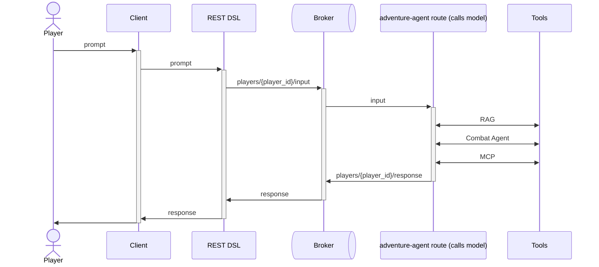

# AI Agent Adventure

## Architecture



## Usage 

### Run an AMQP broker locally

Dev Services doesn't work yet for AMQP. See `todo.md`.


To boot up an ActiveMQ Artemis instance with Podman:
```sh
podman run --detach --name artemis -p 61616:61616 -p 8161:8161 -p 5672:5672 --rm apache/activemq-artemis:latest-alpine
```

Can monitor broker at http://localhost:8161/console/login

### Run Ollama locally

```
podman run -d -v ollama:/root/.ollama -p 11434:11434 --name ollama ollama/ollama
podman exec -it ollama ollama run granite4:1b
```

Or, to install and run in Fedora:

```
sudo dnf install ollama
ollama serve
ollama run granite4:1b
```


### Enter prompts.

```
curl -X POST localhost:8080/camel/player/player01 -H "Content-Type: text/plain" -d "I enter the castle"
```

---

# How to build and run a Camel application

This project was generated using [Camel Jbang](https://camel.apache.org/manual/camel-jbang.html). Please, refer to the online documentation for learning more about how to configure the export of your Camel application.

This is a brief guide explaining how to build, "containerize" and run your Camel application.


## Build the Maven project (JVM mode)

```bash
./mvnw clean package
```

The application could now immediately run:

```bash
java -jar target/quarkus-app/quarkus-run.jar
```

## Create a Docker container (JVM mode)

You can create a container image directly from the `src/main/docker` resources. Here you have a precompiled base configuration which can be enhanced with any further required configuration.

```bash
docker build -f src/main/docker/Dockerfile -t ai-architecture-adventure:1.0.0-SNAPSHOT .
```

Once the application is published, you can run it directly from the container:

```bash
docker run -it ai-architecture-adventure:1.0.0-SNAPSHOT
```

## Build the Maven project (Native mode)

```bash
./mvnw package -Dnative
```

Native compilation can last a few minutes to complete. Once done, the application could immediately run:

```bash
./ai-architecture-adventure-1.0.0-SNAPSHOT-runner
```

## Create a Docker container (Native mode)

You can create a container image directly from the `src/main/docker` resources. Here you have a precompiled base configuration which can be enhanced with any further required configuration.

```bash
docker build -f src/main/docker/Dockerfile.native -t native-ai-architecture-adventure:1.0.0-SNAPSHOT .
```

Once the application is published, you can run it directly from the container:

```bash
docker run -it native-ai-architecture-adventure:1.0.0-SNAPSHOT
```
